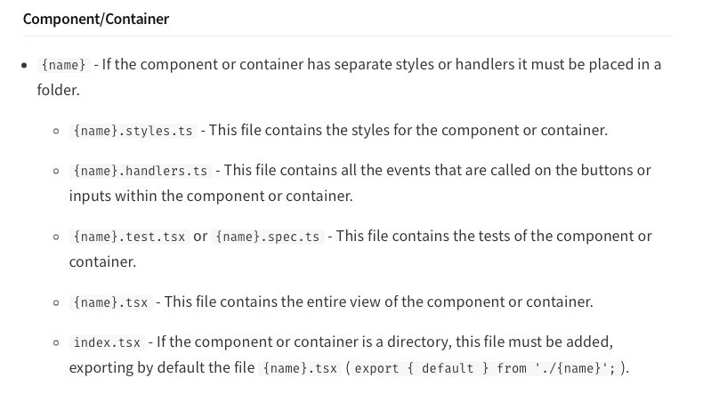
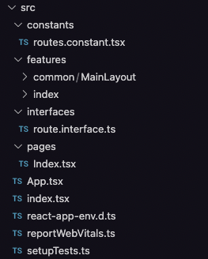
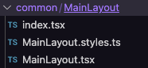
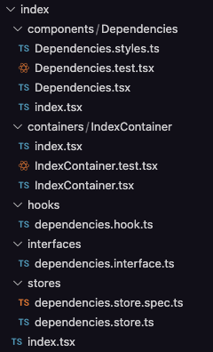

# Explicación estructura repositorio

El proyecto fue creado con CRA (Create React App) usando una plantilla que realicé que tiene: TypeScript, Jest (Para los tests), React Router, Zustand (Temporal, por ahora no se usaría), Material UI v5 y react-app-wired (Para agregar configuraciones personalizadas al webpack sin hacer eject).

Los archivos están en `src/` divididos en 7 carpetas:

1. `constants`, aquí se guardan las constantes que se usan en varios módulos de la aplicación (Rutas, tokens, etc).

2. `features`, aquí se guardan todos los módulos/componentes de la aplicación, se divide en dos sectores:

2.1. `common`, aquí se guardan los componentes individuales (Comparado con atom-design serían los átomos y moléculas) que se usan en dos o más módulos de la aplicación.

2.2. El resto de módulos se guarda con la estructura de la siguiente imagen:

> Los `features` se dividen de esta manera también, lo que se coloque dentro es que solo lo usará ese módulo/componente y no tiene porque salir de ahí

> Si el módulo/componente no posee alguno de los archivos separados, no hay necesidad de ponerlo en una carpeta.
>
> Ejemplo, tenemos un componente en `common` que es solo un botón sin estilos personalizados o handlers, solo se crea el archivo `.tsx`.

3. `hooks`, aquí se ponen los hooks globales, es decir, se usan en dos o más módulos (Autenticación, permisos, etc)

4. `interfaces`, aquí se ponen las interfaces que se usan en dos o más módulos o en los hooks/stores que sean globales.

5. `pages`, aquí se alojan las páginas, estilo NextJS (Solo que necesitan colocarse en el `routes.constant.tsx`).

6. `stores`, aquí se guardan los stores globales, en el caso de Zustand, en Redux se reemplazaría por reducers y actions.

7. `utils`, las utilidades globales.

## Ejemplos

### Organización `src`

### Organización de un `feature` común

### Organización de un `feature`

## ¿Por qué esta estructura?

Es más fácil y rápido pasar módulos/componentes entre aplicaciones y se tiene todo centralizado en una carpeta relacionado a lo que tiene que usar ese componente.

Así, si otro proyecto es creado con esa estructura, para pasarlo solo es copiar la carpeta y se pasarán los hooks, estilos e interfaces que use ese componente/módulo
